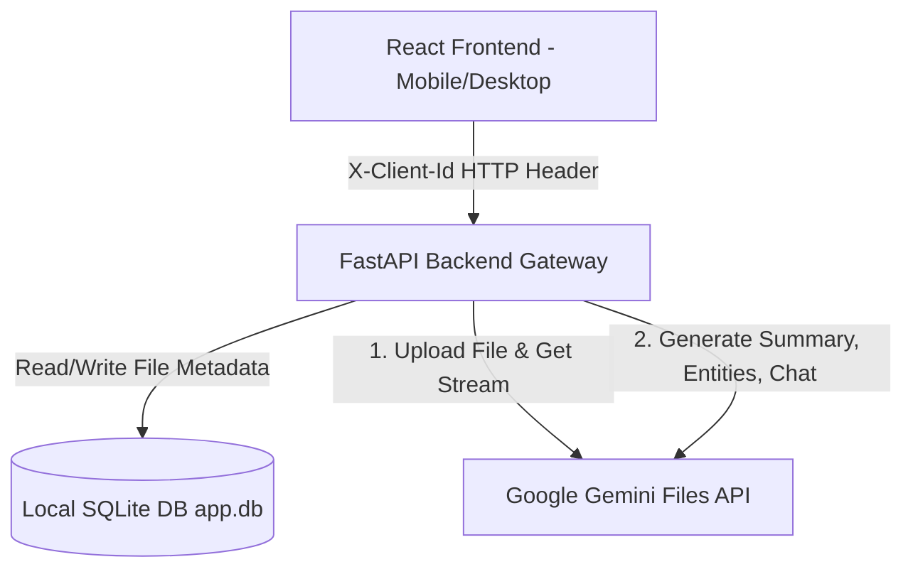

# PROJECT DEVELOPMENT REPORT
**Course Work:** Vibe Coding Masterclass Series  
**Project Title:** AURA Document Analyzer  
**Live AWS URL:** http://aura-doc-analyzer-env.eba-mdmg2bkc.ap-south-1.elasticbeanstalk.com  

---

## 1. Application Overview & Tech Stack
AURA is a containerized, full-stack AI-powered document intelligence web application. It parses, summarizes, structures, and chats with text or scanned documents.

### Tech Stack:
*   **Frontend:** React (Vite) styled with Vanilla CSS (Glassmorphism layout).
*   **Backend:** Python 3.12, FastAPI (Uvicorn), and `google-genai` SDK.
*   **Database:** SQLite (local metadata storage).
*   **AI Engine:** Google Gemini API (`gemini-2.5-flash` model).
*   **Deployment:** Docker (Multi-stage build) hosted on AWS Elastic Beanstalk.

---

## 2. Prompting Strategy & LLM Frameworks
AURA leverages the Google GenAI SDK with custom prompt engineering to obtain structured outputs:
1.  **System Instructions:** Passed to configure the model persona as an expert document analyzer.
2.  **Structured Output Schema:** Utilizes JSON-schema prompting for entity extraction (enforcing outputs to strictly contain names, dates, financial values, and tasks).
3.  **Chat Dialog Context:** Appends chat history arrays `[{"role": "user/model", "content": "..."}]` along with the file reference in every chat query to facilitate conversational context.

---

## 3. Application Architecture
The architecture flows from the user's browser, through the FastAPI gateway, directly interacting with a local SQLite database for session tracking and Google's Gemini servers for document reasoning:

---

## 4. Phase-by-Phase Development Summary
*   **Phase 1: Conceptualization & UI Makeover:** Formulated the layout and applied a premium design system (Deep Indigo, Icy Lavender, Soft Purple) with glassmorphism components.
*   **Phase 2: Backend API & File Parsing:** Configured FastAPI routes for uploads and connected to the Gemini Files API to support text and image-only scanned PDFs.
*   **Phase 3: Core AI Features:** Built summarization, entity parsing tables, tone rewriting, and Server-Sent Events (SSE) streaming for interactive chat.
*   **Phase 4: Mobile Optimization:** Fixed CSS heights from `100vh` to `100dvh` to prevent mobile browser address bar clipping, and containerized scroll panels.
*   **Phase 5: Local Database & Client Isolation:** Dropped Supabase free tier and implemented a local SQLite database. Introduced browser `localStorage` UUID generator and passed it via `X-Client-Id` headers to isolate user data securely.
*   **Phase 6: Deployment:** Wrote a unified Dockerfile serving the compiled React frontend directly from the FastAPI static folder. Deployed the Docker image to AWS Elastic Beanstalk.

---

## 5. Challenges Encountered & Resolutions
1.  **Challenge: Sharing Uploaded PDFs Between Users**
    *   *Resolution:* Generated a unique client ID in the user's browser and scoped all SQLite queries with `WHERE client_id = ?`. This isolates documents by device without needing login.
2.  **Challenge: Mobile Viewport Height Clipping**
    *   *Resolution:* Replaced standard `100vh` rules with dynamic viewport units (`100dvh`) and set internal scroll heights on the active chat layout so the input bar remains fixed at the bottom.
3.  **Challenge: Gemini 429 Rate Limits & Network Drops**
    *   *Resolution:* Added rate-limit detection and returned clean HTTP 429 warnings. Implemented automatic single-request retry logic in the backend for transient SSL protocol connection drops.

---

## 6. Key Learnings & Reflections
*   **Vibe Coding Efficiency:** AI-assisted pair programming accelerated development, permitting complex features like streaming and database migration to be built in hours rather than weeks.
*   **Containerization Benefits:** Packaging both React and FastAPI into a single Docker container simplified hosting, eliminating CORS issues and easing the AWS Elastic Beanstalk configuration.
