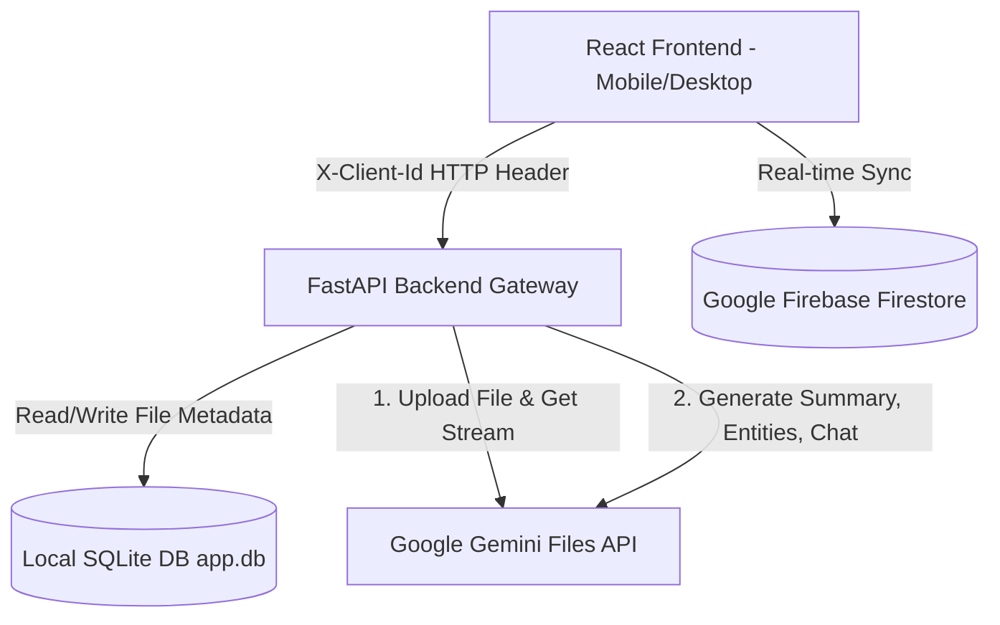

# PROJECT DEVELOPMENT REPORT
**Course Work:** Vibe Coding Masterclass Series (IBM SkillsBuild Internship)  
**Project Title:** AURA Document Analyzer  
**Live AWS URL:** http://aura-doc-analyzer-env.eba-mdmg2bkc.ap-south-1.elasticbeanstalk.com  

---

## 1. Application Overview & Tech Stack
AURA is a containerized, full-stack AI-powered document intelligence web application. It parses, summarizes, structures, and chats with text or scanned documents.

### Tech Stack:
*   **Frontend:** React (Vite) styled with Vanilla CSS (sketchbook notebook ruled theme).
*   **Backend:** Python 3.12, FastAPI (Uvicorn), and `google-genai` SDK.
*   **Database:** SQLite (local metadata storage) + Firebase Firestore (persistent cloud database).
*   **Authentication:** Firebase Auth (Google Sign-In & Email-Password).
*   **AI Engine:** Google Gemini API (`gemini-2.5-flash` model with fallbacks).
*   **Deployment:** Docker (Multi-stage build) hosted on AWS Elastic Beanstalk.

---

## 2. Prompting Strategy & LLM Frameworks
AURA leverages the Google GenAI SDK with custom prompt engineering to obtain structured outputs:
1.  **System Instructions:** Passed to configure the model persona as an expert document analyzer.
2.  **Structured Output Schema:** Utilizes JSON-schema prompting for entity extraction (enforcing outputs to strictly contain names, dates, financial values, and tasks).
3.  **Chat Dialog Context:** Appends chat history arrays `[{"role": "user/model", "content": "..."}]` along with the file reference in every chat query to facilitate conversational context.

---

## 3. Application Architecture
The architecture flows from the user's browser, through the FastAPI gateway, directly interacting with a local SQLite database for session tracking and Google's Gemini servers for document reasoning, while maintaining permanent storage synchronization in Firebase Firestore:

---

## 4. Phase-by-Phase Development Summary
*   **Phase 1: Conceptualization & UI Makeover:** Formulated the layout and applied a sketchbook ruled notebook aesthetic with a custom color palette, responsive sidebar, and custom loader.
*   **Phase 2: Backend API & File Parsing:** Configured FastAPI routes for uploads and connected to the Gemini Files API to support text and image-only scanned PDFs.
*   **Phase 3: Core AI Features:** Built summarization, entity parsing tables, tone rewriting, and Server-Sent Events (SSE) streaming for interactive chat.
*   **Phase 4: Mobile Optimization:** Fixed CSS heights using `100dvh` units, containerized scroll panels, and implemented a responsive mobile hamburger menu navbar.
*   **Phase 5: Local Database & Client Isolation:** Dropped Supabase free tier and implemented a local SQLite database. Introduced browser `localStorage` UUID generator and passed it via `X-Client-Id` headers to isolate user data securely.
*   **Phase 6: Deployment:** Wrote a unified Dockerfile serving the compiled React frontend directly from the FastAPI static folder. Deployed the Docker image to AWS Elastic Beanstalk.
*   **Phase 7: Firebase Authentication & Firestore Persistence:** Added Email/Password & Google Sign-In options. Built a real-time Firestore synchronization sync layer for uploaded document metadata, AI summaries, tone rewrites, and chat history.
*   **Phase 8: Self-Healing Gateway:** Implemented a backend middleware that intercepts calls and automatically re-populates the backend SQLite registry using Firestore reference headers (`X-Gemini-Name`, `X-File-Name`), solving the multi-device sync and AWS ephemeral storage issues.
*   **Phase 9: Workspace Deletion:** Added delete buttons next to document lists, wiping files from the backend gateway, Gemini Files, and Firestore database.

---

## 5. Challenges Encountered & Resolutions
1.  **Challenge: Sharing Uploaded PDFs Between Users**
    *   *Resolution:* Scoped all SQLite queries with `WHERE client_id = ?`. This isolates documents by device without needing login.
2.  **Challenge: Ephemeral Cloud Storage & Multi-Device Sync**
    *   *Resolution:* Integrated Firebase Firestore to save all document metadata and analysis permanently. Developed a self-healing backend API gateway that detects missing local SQLite files and restores them dynamically using custom headers from the frontend Firestore data.
3.  **Challenge: Mobile Viewport Height Clipping & Stacked Navbar**
    *   *Resolution:* Replaced standard `100vh` rules with dynamic viewport units (`100dvh`). Reorganized the navigation links into a responsive hamburger dropdown menu overlay on mobile screens.
4.  **Challenge: Gemini 429 Rate Limits & Network Drops**
    *   *Resolution:* Added rate-limit detection and returned clean HTTP 429 warnings. Implemented automatic fallback to newer/lighter models and added single-request retry logic in the backend for transient network connection drops.

---

## 6. Key Learnings & Reflections
*   **Vibe Coding Efficiency:** AI-assisted pair programming accelerated development, permitting complex features like real-time cloud database synchronization and self-healing gateways to be designed and deployed in hours.
*   **Containerization Benefits:** Packaging both React and FastAPI into a single Docker container simplified hosting, eliminating CORS issues and easing the AWS Elastic Beanstalk configuration.
